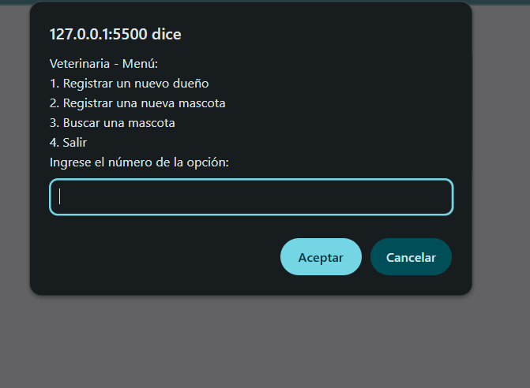
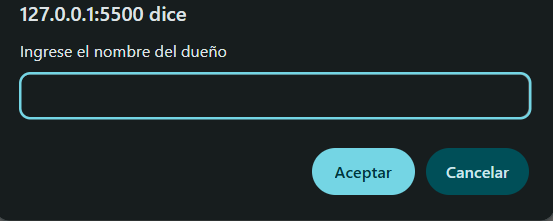

# Veterinaria - Sistema de Registro de Dueños y Mascotas

## Descripción del proyecto

Este proyecto es una aplicación sencilla para gestionar el registro de dueños y sus mascotas en una veterinaria. Permite registrar nuevos dueños, registrar mascotas asociadas a esos dueños, y buscar mascotas por nombre. La interfaz es mediante ventanas emergentes (`prompt` y `alert`) para facilitar la interacción básica sin necesidad de una interfaz gráfica compleja.

## Tecnologías usadas

- **JavaScript**: Lenguaje principal para la lógica de la aplicación.
- **Navegador web**: La aplicación se ejecuta en el entorno del navegador usando funciones nativas como `prompt`, `alert` y `setTimeout`.

## Explicación breve sobre cómo aplicaron asincronía

La aplicación utiliza la función `setTimeout` para simular procesos asincrónicos, como la espera de respuesta o procesamiento al registrar un dueño o una mascota. Esto permite que el menú principal espere un tiempo prudente antes de mostrarse nuevamente, simulando un retardo típico en operaciones reales (como llamadas a bases de datos o servidores). Así, se mejora la experiencia del usuario evitando que el menú se muestre inmediatamente y se pierda la información mostrada en alertas.

## Capturas de pantalla o GIF (opcional)

*(Aquí puedes agregar imágenes o GIFs que muestren la aplicación en funcionamiento, por ejemplo, la ventana del menú, el registro de un dueño o mascota, y la búsqueda de mascotas.)*

